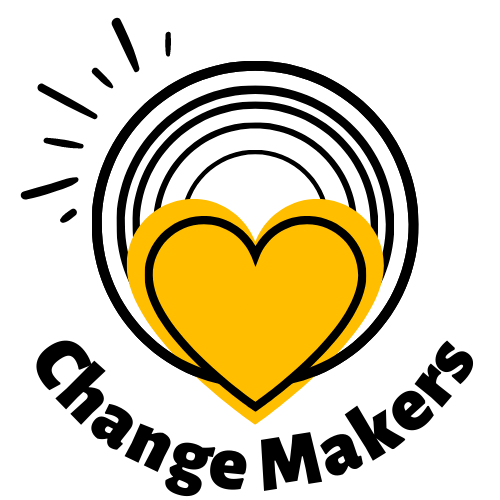

**ChangeMakers** has been designed to make it easier for people to find volunteer opportunities near them, and for institutions to find qualified volunteers for upcoming events.

:office: Institutions can create events/opportunities and set up the skills they need for each particular one. 

:standing_man: Volunteers can select up to 3 skills for themselves and sign up for events/opportunities. They can search the events based on their location, the Institution cause or/and the matching skills. They can also leave a comment and rate the Institution they worked with.

## Table of contents
🤖 [Technologies](#technologies-used)

⭐ [Features](#features)

📖 [Set Up](#set-up)

🌸 [About Me](#about-me)

## Technologies Used
* Backend: Python, Flask, SQL, PostgreSQL, SQLAlchemy.
* Frontend: Javascript, React JS, HTML, CSS, Bootstrap, AJAX, JSON, Jinja2.
* APIs: Geolocation API, Google Maps API.

## Features

